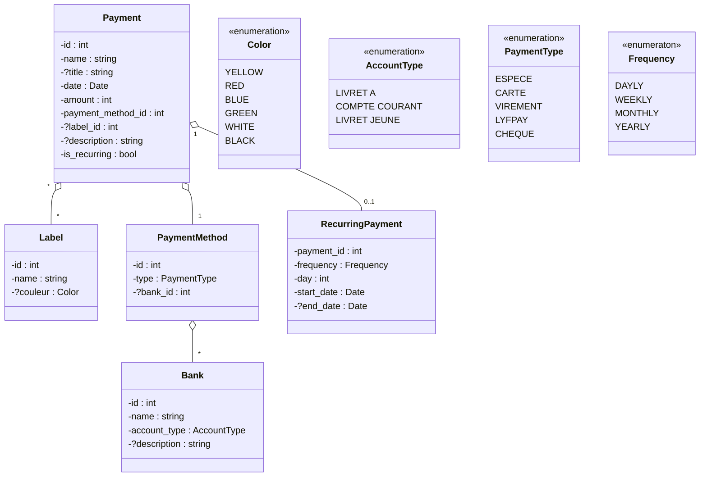

# Backend

## Diagramme représentant les données

```mermaid
classDiagram
    Payment "*" o-- "*" Label
    Payment o-- "1" PaymentMethod
    PaymentMethod o-- "*" Bank
    Payment "1" o-- "0..1" RecurringPayment
    class Payment{
      -id : int
      -name : string
      -?title : string
      -date : Date
      -amount : int
      -payment_method_id : int
      -?label_id : int
      -?description : string
      -is_recurring : bool
    }

    class Label{
      -id : int
      -name : string
      -?couleur : Color
    }
    class PaymentMethod{
      -id : int
      -type : PaymentType
      -?bank_id : int
    }

    class Bank{
        -id : int
        -name : string
        -account_type : AccountType
        -?description : string
    }

    class RecurringPayment{
        -payment_id : int
        -frequency : Frequency
        -day : int
        -start_date : Date
        -?end_date : Date
    }

    class Color{
        <<enumeration>>
        YELLOW
        RED
        BLUE
        GREEN
        WHITE
        BLACK
    }

    class AccountType{
        <<enumeration>>
        LIVRET A
        COMPTE COURANT
        LIVRET JEUNE
    }

    class PaymentType{
        <<enumeration>>
        ESPECE
        CARTE
        VIREMENT
        LYFPAY
        CHEQUE
    }

    class Frequency{
        <<enumeraton>>
        DAYLY
        WEEKLY
        MONTHLY
        YEARLY
    }
```
